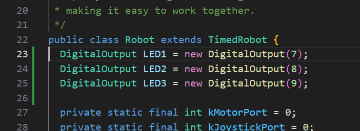
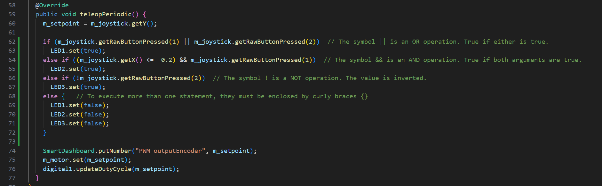

# Java Basics
Do not save any code to the Desktop!  It will quickly become difficult to organize and find what you need.

> Each laptop has a folder called C:\Users\\[PabloComputer].
> Create a folder named “FRC2025” and save all your code there.

I have found this video to be a very good introduction to Java (all the current programmers learned from this), but it is a bit long.  The good thing is that it is broken up into well marked chapters that you can view if you don't understand a topic:
[A very good Java introduction - this link skips the intro](https://www.youtube.com/watch?v=eIrMbAQSU34&t=239s)
We are not going to watch it in the meeting, but I strongly suggest you view it at home.

## Structure
```java
package frc.robot;

import edu.wpi.first.wpilibj.RobotBase;

public final class Main {
  private Main() {}

  public static void main(String... args) {
    RobotBase.startRobot(Robot::new);
  }
}
```

* Everything is an object (an encapsulation)
* All statements are terminated with a semicolon.
* "public" objects can be accessed by other parts of the program
* "private" objects cannot be modified from the outside

## Variables
### Primitive Types

| Type | Storage Size | Value Range | Precision |
| --- | --- | --- | --- | 
| byte | 1 byte | 2<sup>8</sup> or [-128, 127] | |
| short | 2 byte | 2<sup>16</sup> or [-32768, 32767] | |
| int | 4 byte | 2<sup>32</sup> or [-2147483648, 2147483647] | Over 2 billion |
| long | 8 byte | 2<sup>64</sup> or [-9223372036854775808, 9,223,372,036,854,775,807] | Over 9 Quintillion! (10<sup>18</sup> or exa) |
| float | 4 byte | 1.2E-38 to 3.4E+38 | 6 decimal places |
| double | 8 byte | 2.3E-308 to 1.7E+308 | 15 decimal places |
| char | 2 byte | A, B, C, … | |
| boolean | 1 byte | true / false | |

[Detail on floating point numbers](https://learn.microsoft.com/en-us/cpp/c-language/type-float?view=msvc-170)

### Declaring Variables
```java
byte age = 30;
long viewsCount = 3_123_456L;
float price = 10.99F;
double distance = 6.35;
char letter = ‘A’;
boolean isEligible = true;
```

* We will use ```int``` and ```double``` for the vast majority of our coding.
* Define a known starting value for any variable that you create.

### Constants
Constants (also called final variables) have a fixed value. Once we set them, we cannot change them. By convention, we use CAPITAL LETTERS to name constants. Multiple words can be separated using an underscore.

```java
final double INTEREST_RATE = 0.04;
```

### Comments
We use comments to explain our code to other people.

```java
// This is a comment, everything AFTER the slashes is just ignored by the computer.
/* This is also a comment,
   but it can span lines */
```

### Reference Types
In Java we have 8 primitive types. All the other types are reference types. These types don’t store the actual objects in memory. They store the reference (or the address of) an object in memory. To use reference types, we need to allocate memory using the ```new``` operator. The memory gets automatically released when no longer used.

```java
Joystick m_joystick = new Joystick(JOYSTICK_PORT);
```

### Strings
Strings are reference types but we don’t need to use the new operator to allocate memory to them. We can declare string variables like the primitives since we use them a lot.

```java
String robotName = “Kermit”;
```

### Casting
In Java, we have two types of casting:
* Implicit: happens automatically when we store a value in a larger or more precise data type.
* Explicit: we do it manually.

```java
// Implicit casting happens because we try to store a short
// value (2 bytes) in an int (4 bytes).
short x = 1;
int y = x;

// Explicit casting
int x = 1;
short y = (short) x;
```

## Arithmetic Expressions
```java
int x = 10 + 3;
int x = 10 - 3;
int x = 10 * 3;

int x = 10 / 3; // returns an int
double x = (double)10 / (double)3; // returns a double
double x = 10.0 / 3.0; // returns a double

int x = 10 % 3; // modulus (remainder of division)
```

### Order of Operations
Multiplication and division operators have a higher order than addition and subtraction. They get applied first. We can always change the order using parentheses.

```java
int x = 10 + 3 * 2;  // result is 16
int x = (10 + 3) * 2;  // result is 26
```

### Comparison Operators
We use comparison operators to compare values.  The result is a boolean value (`true` or `false`).
```java
(x == y)  // equality operator
(x != y)  // in-equality operator
(x > y)   // greater than
(x >= y)  // greater than or equal
(x < y)   // less than
(x <= y)  // less than or equal
```

### Logical Operators and IF statements
We use logical operators to combine multiple boolean values or expressions.
* x && y (AND): if both x and y are true, the result will be true.
* x || y (OR): if either x or y or both are true, the result will be true.
* !x (NOT): reverses a boolean value. True becomes false.

`if` statements control the flow of execution.  When the condition is true, the statement is executed.

```java
boolean isPressedButtonA = true;
boolean isPressedButtonB = false;
double joystickX = 0.0;

if (isPressedButtonA || isPressedButtonB)  // The symbol || is an OR operation. True if either is true.
  redLED = true;
else if ((joystick <= -0.2) && isPressedButtonA)  // The symbol && is an AND operation. True if both arguments are true.
  greenLED = true;
else if (!isPressedButtonB)  // The symbol ! is a NOT operation. The value is inverted.
  yellowLED = true;
else {   // To execute more than one statement, they must be enclosed by curly braces {}
  redLED = false;
  greenLED = false;
  yellowLED = false;
}
```

What will make each LED light up?

## Programming Exercise
Let's try it out!

1. Open up a blank Visual Studio Code window.  If you see a project when you start the program, select `File` -> `Close Folder`.
2. Clone the RobotDemo repository:

```https://github.com/FRC-Team8744/RoboRio_Demo```

3. Add the following code to Robot.java:



4. Add the control statements to teleopPeriodic():



You can copy and paste from here:
```java
  DigitalOutput LED1 = new DigitalOutput(7);
  DigitalOutput LED2 = new DigitalOutput(8);
  DigitalOutput LED3 = new DigitalOutput(9);


    if (m_joystick.getRawButtonPressed(1) || m_joystick.getRawButtonPressed(2))  // The symbol || is an OR operation. True if either is true.
      LED1.set(true);
    else if ((m_joystick.getX() <= -0.2) && m_joystick.getRawButtonPressed(1))  // The symbol && is an AND operation. True if both arguments are true.
      LED2.set(true);
    else if (!m_joystick.getRawButtonPressed(2))  // The symbol ! is a NOT operation. The value is inverted.
      LED3.set(true);
    else {   // To execute more than one statement, they must be enclosed by curly braces {}
      LED1.set(false);
      LED2.set(false);
      LED3.set(false);
    }
```

5. Ask for a turn to use the mini-robot.  (By the way, the mini-robot needs a name. Who can think of a good one?)
6. Connect to the robot's WiFi and plug in the joystick.
7. Start the Driver Station.
8. Enable the robot, and blink lights!

### The Ternary Operator
There is a more compact way to represent an `if` statement.  Because it can make your code harder to read, we will try to avoid using it - but you might see it in other people's code:
```java
String robotName = (hasShooter == true) ? “Kermit” : “Ms Piggy”;

// This is a shorthand way to write the following code:
String robotName;
if (hasShooter == true)
robotName = “Kermit”;
else
robotName = “Ms Piggy”;
```

### Switch Statements
Switch statements are like `if` statements, but can be easier to read when there are many options.

```java
switch (year) {
  case 2024:
    robotName = "Kermit";
    break;
  case 2023:
    robotName = "Swivels";
    break;
  case 2022:
    robotName = "Thomas";
    break;
  default:
    robotName = "Scrappy";
}
```

After each case clause, we use the break statements to jump out of the switch block.

### Loops
Often, we need to repeat code a certain number of times.  We use loops to control the start, end, and number of iterations.

```java
// For loops will repeat code a specified number times
for (i = 0; i < 5; i=i+1) {  // the variable i is called the "loop counter"
  // Do this stuff
}

// While loops repeat when a condition is true
while (someCondition) {
  // Do this until someCondition is false
}

// Do..While loops will always execute at least once
do {
  // This will always happen once or more
} while (someCondition);
```

### Iterating over a collection
Some of the information we get from the robot is a list of values that we have to iterate through, such as this example showing how we find out if the AprilTag we are looking for is visible to the camera:

```java
// Read in relevant data from the Camera
boolean targetVisible = false;
double targetYaw = 0.0;

var frames = camera.getAllUnreadResults();  // "var" is a variable name used for receiving objects from other code

if (!frames.isEmpty()) {  // Camera processed a new frame since last iteration
  var result = frames.get(frames.size() - 1);  // Get the last one in the list.

  if (result.hasTargets()) {  // At least one AprilTag was seen by the camera

    // A For-each loop is used to iterate over a list that may change size.
    for (var target : result.getTargets()) {

      if (target.getFiducialId() == 7) {  // Found Tag 7, record its information
        targetYaw = target.getYaw();
        targetVisible = true;
      }
    }
  }
}
```

## Bonus Exercise
Make a different LED light up on the robot depending on how far you push the joystick.


#### Documentation Link
https://docs.wpilib.org
