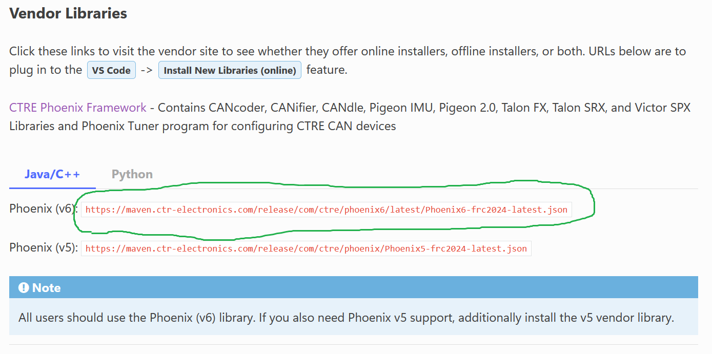
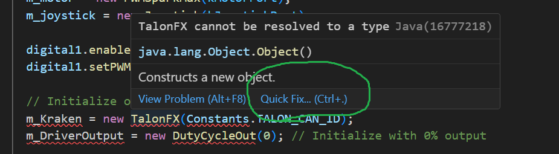
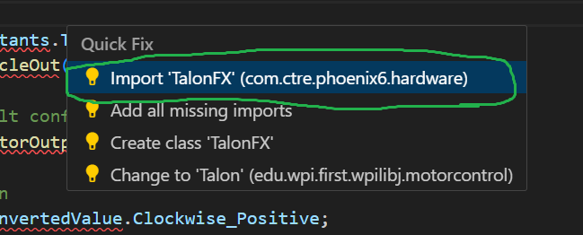

# Learning by example!

We didn't get very far on Tuesday with actual coding examples, so today we will try to focus on that.  (I can't guarantee that these will all work on the first try.)

## Moving a servo motor

This should already be working!  I will see if I can figure out why the LEDs didn't cooperate last time, but there is already an example in place for moving a hobby servo.  This is for a presentation to the whole team.

1. Make sure RoboRio_Demo will build.
2. Plug in a joystick.
3. Start up FRC Driver Station.
4. Connect to the robot wifi.
5. Deploy the RoboRio_Demo code.
6. Enable Teleop mode.
7. Moving the joystick should move the servo.
8. Bonus exercise:
    * Change the code so that the servo will move when you push a button.
    * Hint: On a new line, type `m_joystick.` and look through the options.
    * Hint for hints: Hold your mouse cursor over different objects to see helpful documentation.

## Moving the Kraken!

But first...

### How to add a new driver library
1. Figure out which company makes the motor!
2. Find that company in the [list of 3rd Party Vendor Libraries](https://docs.wpilib.org/en/stable/docs/software/vscode-overview/3rd-party-libraries.html#vendor-libraries)
3. Copy the red text for the library you are interested in:



4. In VSCode, open the command palette with the "W" hexagon and find: `WPILib: Manage Vendor Libraries`
5. Select `Install new libraries (online)`
6. Paste in the red text.
7. VSCode will Build your code.

### Spin the motor
1. Add this code inside `robotInit()`:

```java
    // Initialize objects
    m_Kraken = new TalonFX(Constants.TALON_CAN_ID);
    m_DriverOutput = new DutyCycleOut(0); // Initialize with 0% output

    // start with factory-default configs
    var currentConfigs = new MotorOutputConfigs();

    // Set direction of rotation
    currentConfigs.Inverted = InvertedValue.Clockwise_Positive;

    // Apply configuration settings to motor driver
    m_Kraken.getConfigurator().apply(currentConfigs);

    // Initialize position encoder
    m_Kraken.setPosition(0);
```

2. This will create lots of errors!  Fix them...
3. Hover your cursor over `TalonFX` and select `QuickFix`:



4. Then import the library:



5. Wait, what did that do?  Don't continue until you know!
6. Add the following variable declarations to `public class Robot`:

```java
  private final TalonFX m_Kraken;
  private final DutyCycleOut m_DriverOutput;
```

7. You should be able to correct the rest of the problems with `QuickFix`
8. Finally, add this in `teleopPeriodic()`:

```java
      // Convert joystick position to motor pulse setting
      m_DriverOutput.Output = m_joystick.getX();

      // Instruct the motor to turn at that setting
      m_Kraken.setControl(m_DriverOutput);
```

9. With that, you should be able to Deploy your code.
10. Spin the motor!

