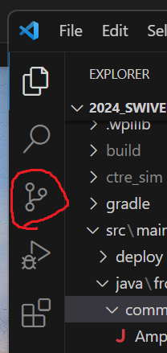
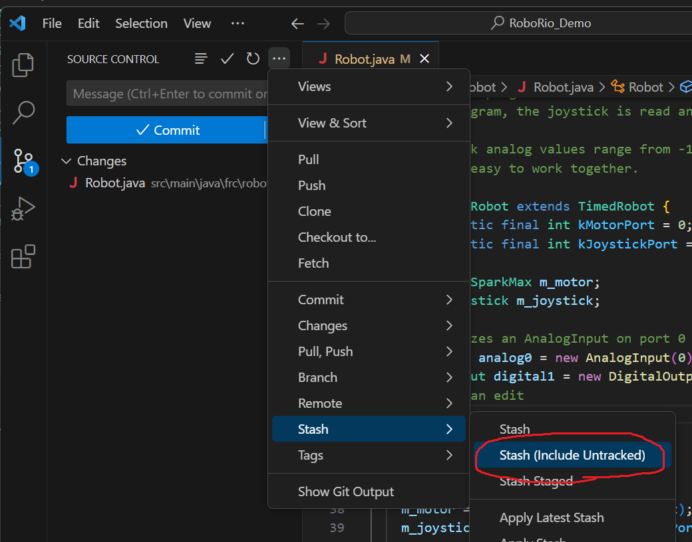
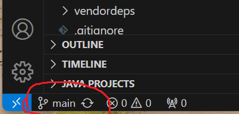
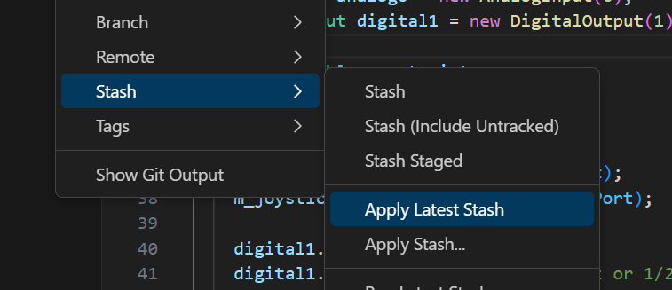

# Working with Git

We have already learned how to `clone` a repository on GitHub, but we can do so much more!  Today we will experiment with stashing, pushing, pulling, and branching.

## Correcting a poor decision...

We have already made many edits to our competition code as we learned about Commands.  But, what if we wanted to save our place in the code and explore what the others have been working on?  Normally, we would have created a `branch` in the repository to store your personal code.  To keep things simple, I had you skip that step.  Now we have to fix it...

1. Load up VSCode and make sure your code will build.
2. Now we have to separate the edits that you made from the original files.  Switch to the "Source Control" tab on the left hand side:

3. "Stash (Include Untracked)" your code changes. Add a name to remember it.

5. The code is now back in the same state it was when you cloned the repository.  Take a look in the lower left corner, and find the name of the branch "main" that you are currently using.  Click on it to see a list of the other branches that exist in the repository.  See the names of the other students?

6. Create a new branch with your name for your personal code changes.
7. You are now in your own branch that is based on the `main` code.  Let's recall your `stash` to get the code changes you made last week.

8. Now we have your code changes in your own branch, but they are only saved on your computer.  We want to make a 'commit' that will store the state of your code the way it is now.  Stage and commit.
9. You have now stored your code in the repository on your computer.  This is only a local repository, so if your computer hard drive had a failure then your code would be gone.  We now copy your commit to the GitHub repository with `Publish Branch`.
10. Let's find your code with a web browser!

## Exploring other branches

Let's take a look at someone else's code.

1. Click on the branch name that you want to change over to.
2. Find a difference that is not in your code.

## Programming challenge!
1. Complete the sequential command group code from last week if you didn't get a chance to test it.
2. Create and run a `ParallelCommandGroup` command group to see the difference.
2. Create and run a `ParallelDeadlineGroup` or `ParallelRaceGroup`.

## Learn about merging other people's code
[Merge in VSCode](https://www.youtube.com/watch?v=HosPml1qkrg)

### Resources
* [FRC documentation for Git](https://docs.wpilib.org/en/stable/docs/software/basic-programming/git-getting-started.html)
* [VSCode introduction to Git](https://code.visualstudio.com/docs/sourcecontrol/overview)
* [How do I do this with Git?](https://github.com/k88hudson/git-flight-rules/blob/master/README.md)

