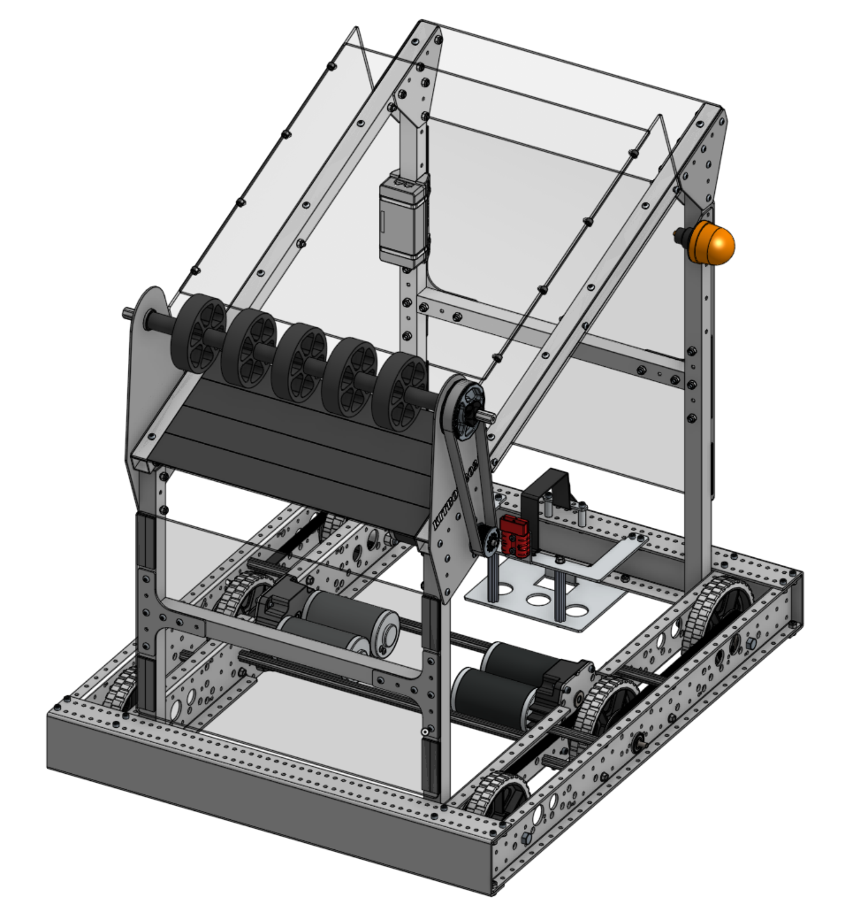

# 2025 Kickoff

New (not quite water) Game!  Now what?

## Update! Update! Update!

1. Claim your laptop if you have not already. Put your name on it in tape! If you like a mouse, claim it too!
2. Update FRCTools: [National Instruments FRC Tools](https://docs.wpilib.org/en/stable/docs/zero-to-robot/step-2/frc-game-tools.html#download-game-tools)
    * Don't bother making a login - just ask Mentor Alex to log in
3. Update VSCode: [WPILIB VS Code](https://docs.wpilib.org/en/stable/docs/zero-to-robot/step-2/wpilib-setup.html#downloading)
    * "For this user only"
    * "Download for this computer only"
4. Update vendor libraries
    * At the time of writing, PathPlanner Lib BETA was the only version working.
5. In settings, turn off "Inlay Hints"
6. Move all the 2024 WPILib tool icons into an "Old FRC" folder

## Veteran programmers: plan out the SOFTWARE architecture

* No coding! Whiteboard only!
* Top down
    - What functionality will the robot need?
    - Will the base code need changes?
    - What will the driver need?
    - How will the subsystems interact with each other?
    - Will positioning need to be accurate?
    - Focus on bare minimum requirements for the first scrimmage

## Rookie programmers
What's a kitbot?

* [Game & Season Info](https://www.firstinspires.org/robotics/frc/game-and-season)  This is where you find general information about the game.
* [KitBot info](https://www.firstinspires.org/resource-library/frc/kitbot)
* [KitBot software overview](./Notes00_files/KitBot_Java_Software_Guide.pdf)

## KitBot Code

1. Clone: [https://github.com/FRC-Team8744/2025_KitBot](https://github.com/FRC-Team8744/2025_KitBot)
2. CREATE YOUR OWN BRANCH!
